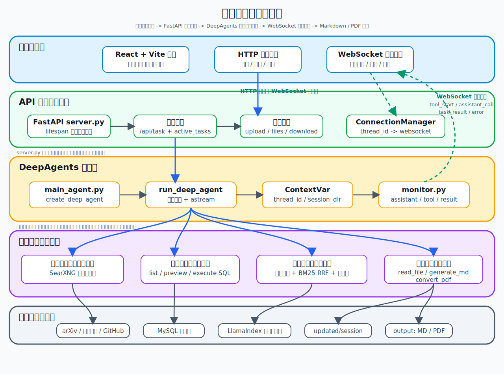

<div align='center'>
  <h1 style="margin-top: 15px;">DeepSearch Agents — 论文研读多智能体系统</h1>
  <h4><b>deepsearch-agents</b></h4>
  <p><em>面向学术论文文献调研场景，基于 DeepAgents + LangGraph 构建的多智能体深度研究系统，支持多来源检索、RAG 增强生成、结构化证据链与自动报告交付</em></p>
</div>

<div align='center'>


</div>

> **本仓库基于 [didilili/deepsearch-agents](https://github.com/didilili/deepsearch-agents)（深度研搜）进行二次开发**，在原版一主三从多智能体架构基础上，围绕**工程可靠性、论文证据链、检索可观测性**三个方向进行了深度改造与增强，适用于面试展示和个人项目扩展。

---

## 与原版的差异

| 维度 | 原版 | 本版 |
|------|------|------|
| **搜索后端** | Tavily（付费 API，需额度） | **SearXNG**（自托管，零费用，聚合 70+ 引擎） |
| **知识库** | RAGFlow（外部服务，需部署） | **LlamaIndex**（本地索引，自包含部署） |
| **应用方向** | 通用行业研究 | **学术论文文献综述** |
| **存储** | JSON 文件（并发写入丢数据） | **SQLite + WAL 事务**（并发安全） |
| **运行目录** | 不统一（app/output、output/、/app/output） | **DATA_ROOT 统一收敛**到 data/ 目录 |
| **数据隔离** | thread_id 会话隔离 | **user_id + workspace_id + thread_id** 三层隔离 |
| **上传限制** | 无限制 | 数量 ≤5、大小 ≤20MB、后缀白名单 |
| **SQL 防护** | 仅前缀白名单 | 前缀白名单 + **多语句拦截 + 关键字过滤 + 表名白名单 + 超时** |
| **路径安全** | 基础校验 | **resolve() + is_relative_to()** 双层防穿越 |
| **长期记忆** | JSON 文件关键词匹配 | SQLite 持久化，并发事务安全 |
| **任务管理** | 内存 active_tasks | **信号量限流（默认 4）+ 超时控制（默认 300s）** |
| **健康检查** | 无 | **/health/live + /health/ready** 接口 |
| **运行事件** | WebSocket 实时推送（断线丢失） | WebSocket 推送 + **SQLite 持久化 + 历史拉取接口** |
| **检索测试** | 无 | **POST /api/retrieval/test + 前端检索测试面板** |
| **证据结构** | 纯文本拼接 | **结构化 evidence 数组**（source/page/score/quote/metadata） |
| **引用校验** | 无 | **自动提取 claim 标记 → MiniLM 语义匹配 → verified/low/unfounded** 量化 |
| **论文卡片** | 无 | **论文卡片 + 对比矩阵 + 综述报告** 分阶段管线 |
| **评测** | 6 条 query，终端输出 | **20 条 query + Markdown 表格输出 + CLI 参数** |
| **模型缓存** | HuggingFace 默认用户目录 | **收敛到 data/model_cache**，容器部署无权限问题 |
| **索引管理** | 基础 manifest | **记录 embedding 模型 + chunk 参数**，换模型自动重建 |
| **前端主题** | 冷蓝科技风 | Neo Kinpaku（金箔）暖黑金配色 |
| **前端断线恢复** | 无 | **WebSocket 重连 + 拉取历史事件**补全执行过程 |

---

## 系统架构



### 一主三从

```
主智能体 (论文研究团队负责人)
├── tools: generate_markdown, convert_md_to_pdf, read_file_content
├── subagents:
│   ├── 公开学术资料搜索助手 → SearXNG 自托管搜索
│   ├── 论文元数据查询助手   → MySQL 结构化查询
│   └── 论文知识库研读助手   → LlamaIndex 本地检索 (向量 + BM25 + RRF + 重排序)
└── checkpointer: InMemorySaver (thread_id 隔离)
```

### 关键技术实现

| 层级 | 技术 | 说明 |
|------|------|------|
| Agent 框架 | DeepAgents + LangGraph | 一主三从 Orchestrator-Workers，interrupt 机制调度子智能体 |
| LLM 接入 | OpenAI 兼容接口（Qwen / DeepSeek / GPT） | `.env` 配置，更换模型不需改代码 |
| 搜索引擎 | SearXNG（自托管 Docker） | 聚合 arXiv、Google Scholar、GitHub，零费用 |
| 结构化数据 | MySQL 8.4 + mysql-connector-python | 只读白名单 + 多语句拦截 + 表名白名单 |
| 知识库索引 | LlamaIndex + SentenceSplitter | 本地向量索引，chunk_size=512, overlap=64 |
| 检索流水线 | 向量 → BM25 → RRF → MiniLM 重排序 | 4 层逐步精排，MRR 提升 45% |
| 文件处理 | pypdf / python-docx / pandas / ReportLab | 多格式读取 + Markdown/PDF 生成 |
| 异步服务 | FastAPI + Uvicorn + asyncio | 后台协程 + WebSocket 实时推送 |
| 会话安全 | ContextVar + path_utils | 协程级隔离 + 路径穿越防护 |
| 持久化 | SQLite + WAL | 会话、事件、证据、记忆、引用校验全量持久化 |
| 容器化 | Docker Compose（4 容器） | MySQL + Backend + Frontend + SearXNG |

### 检索流水线

```
query
  → LlamaIndex 向量检索 (candidate_k = top_k × 2)
  → rank_bm25 在同一候选集上计算 BM25 分数
  → RRF 融合: score = 1/(k+vector_rank) + 1/(k+bm25_rank)
  → BM25 降级兜底 (max < 0.1 → 纯向量)
  → [可选] MiniLM 语义重排序 (cosine similarity)
  → 返回结构化 evidence: {source, page, score, quote, metadata}
```

| Strategy | Recall@3 | Recall@5 | Recall@10 | MRR |
|---|---|---|---|---|
| 纯向量 | 0.1500 | 0.1500 | 0.1500 | 0.1500 |
| 混合(BM25+向量) | 0.3750 | 0.3750 | 0.3750 | 0.3917 |
| 全链路(+rerank) | 0.4000 | 0.4500 | 0.4500 | **0.4167** |

> 评测集：20 条 query，覆盖 10 篇论文。运行 `uv run python -m app.evaluation.evaluate --format md`

### 引用校验

```
生成报告 → 提取 【证据: xxx】/【来源: 标题, p.5】 标记
         → 查 evidence_records 表
         → MiniLM 计算 claim 与 quote 的语义相似度
         → ≥ 0.5 verified / 0.25-0.5 low_confidence / < 0.25 unfounded
         → 写入 SQLite，返回量化指标 (覆盖率、unfounded 率)
```

---

## 快速开始

### 环境要求

- Python ≥ 3.12
- `uv`（Python 包管理器）
- Docker & Docker Compose
- Node.js ≥ 18 + `pnpm`
- OpenAI 兼容的 LLM API Key

### 1. 克隆

```bash
git clone https://github.com/linkage18/Deepsearch-agent.git
cd deepsearch-agents
```

### 2. 安装后端依赖

```bash
uv sync
```

### 3. 配置环境变量

```bash
cp .env.example .env
```

编辑 `.env`，至少配置以下项：

```ini
# LLM 配置（必须）
OPENAI_BASE_URL=https://dashscope.aliyuncs.com/compatible-mode/v1
OPENAI_API_KEY=你的_API_KEY
LLM_QWEN_MAX=qwen-max

# MySQL 配置（首次启动一定要改端口为 3307，避免和本地冲突）
MYSQL_USER=root
MYSQL_PASSWORD=root
MYSQL_DATABASE=deepsearch_db
MYSQL_HOST=localhost
MYSQL_PORT=3307
```

### 4. 启动 Docker 服务

```bash
docker compose -f docker/docker-compose.yaml up -d
```

这会启动 MySQL 8.4（含论文元数据教学数据）和 SearXNG 自托管搜索引擎。

### 5. 启动后端

```bash
# 确保没有旧进程占着 8000 端口，有则先 taskkill /F /IM python.exe
uv run uvicorn app.api.server:app --host 0.0.0.0 --port 8000
```

> 注意：不要加 `--reload`，热重载在某些环境下会导致旧进程残留阻塞端口。如果遇到 404，先 `taskkill /F /IM python.exe` 再重试。

启动成功后新开终端验证：

```bash
curl http://localhost:8000/health/live
# → {"status":"ok"}
```

### 6. 启动前端

```bash
cd frontend
pnpm install
pnpm dev
```

前端默认连接 `http://localhost:8000`，启动后访问 `http://localhost:5173` 即可。

### 7. 试几个任务

```text
调研影响力最大化算法的最新研究进展
```

```text
搜索 ReAct 论文的相关资料，生成一篇 Markdown 调研报告
```

```text
对比 MIM-Reasoner 和 Graph Bayesian Optimization 的方法差异
```

---

## API 接口清单

| 方法 | 路径 | 说明 |
|------|------|------|
| POST | `/api/task` | 提交调研任务 |
| POST | `/api/task/{id}/cancel` | 取消任务 |
| POST | `/api/upload` | 上传文件（≤5 个，单文件 ≤20MB） |
| POST | `/api/knowledge/upload` | 上传 PDF 到论文库 |
| POST | `/api/retrieval/test` | 论文库检索测试（不启动 Agent） |
| POST | `/api/paper-cards/build` | 构建论文卡片 |
| POST | `/api/review-report` | 生成综述报告 |
| POST | `/api/report/{id}/verify` | 触发引用校验 |
| GET | `/api/report/{id}/verification` | 返回引用校验统计 |
| GET | `/api/files` | 列出生成文件 |
| GET | `/api/download` | 下载文件 |
| GET | `/api/sessions` | 历史会话列表 |
| GET | `/api/sessions/{id}` | 会话详情 |
| GET | `/api/task/{id}/events` | 历史运行事件（断线恢复用） |
| GET | `/api/evidence` | 证据记录列表 |
| GET | `/api/paper-cards` | 论文卡片列表 |
| GET | `/api/paper-matrix` | 论文对比矩阵 |
| GET | `/health/live` | 存活检查 |
| GET | `/health/ready` | 就绪检查 |
| WS | `/ws/{id}` | 实时事件推送 |

---

## 项目结构

```
deepsearch-agents/
├── app/
│   ├── agent/                    # 主智能体 + 子智能体 + LLM 初始化
│   │   ├── subagents/            # 网络搜索 / 数据库查询 / 论文知识库 三个助手
│   │   ├── main_agent.py         # create_deep_agent + run_deep_agent 执行入口
│   │   ├── llm.py                # OpenAI 兼容模型初始化
│   │   └── prompts.py            # YAML 提示词加载
│   ├── api/
│   │   ├── server.py             # FastAPI 全部接口
│   │   ├── monitor.py            # WebSocket 事件推送 + 审计日志
│   │   └── context.py            # ContextVar 会话隔离
│   ├── config/
│   │   ├── paths.py              # DATA_ROOT 统一目录配置
│   │   └── retrieval_config.py   # 检索参数配置 (RRF / rerank / chunk)
│   ├── evaluation/
│   │   └── evaluate.py           # 检索评测 (支持 --format md)
│   ├── memory/
│   │   └── memory_store.py       # SQLite 长期记忆
│   ├── models/
│   │   └── session.py            # SQLite 数据模型 (会话/事件/证据/卡片/引用)
│   ├── prompt/
│   │   └── prompts.yml           # 智能体提示词配置
│   ├── services/
│   │   ├── paper_card_service.py # 论文卡片构建
│   │   ├── paper_matrix_service.py # 论文对比矩阵
│   │   └── review_report_service.py # 综述报告生成
│   ├── tools/
│   │   ├── search_tool.py        # SearXNG 搜索工具
│   │   ├── db_tools.py           # MySQL 查询工具 (只读白名单 + 防注入)
│   │   ├── llamaindex_tools.py   # LlamaIndex 检索工具 (向量 + BM25 + RRF + 重排序)
│   │   ├── rerank_tools.py       # MiniLM 重排序
│   │   ├── citation_checker.py   # 引用校验模块
│   │   ├── markdown_tools.py     # Markdown 生成
│   │   ├── pdf_tools.py          # PDF 转换 (ReportLab)
│   │   └── upload_file_read_tool.py  # 上传文件读取
│   └── utils/
│       ├── path_utils.py         # 路径解析 (防穿越)
│       └── word_converter.py     # PDF 底层转换
├── data/                         # 运行时数据 (DATA_ROOT)
│   ├── uploads/                  # 用户上传文件
│   ├── reports/                  # 生成报告
│   ├── papers/                   # 论文 PDF 库
│   ├── paper_index/              # LlamaIndex 索引
│   └── sessions.sqlite3          # SQLite 全量持久化
├── docker/
│   ├── docker-compose.yaml       # 4 容器编排
│   ├── Dockerfile.backend        # 后端镜像
│   ├── Dockerfile.frontend       # 前端镜像
│   ├── mysql/mysql.sql           # 论文元数据教学数据
│   └── searxng/settings.yml      # SearXNG 配置
├── docs/                         # 架构文档 / 知识库示例 PDF / 评测数据
├── examples/                     # DeepAgents 学习示例 (15 个)
├── frontend/                     # React + Vite 前端
├── tests/
│   ├── test_production_hardening.py  # 工程可靠性测试
│   └── test_citation_verification.py # 引用校验测试
├── .env.example
├── pyproject.toml
└── requirements.txt
```

---

## 安全控制

| 机制 | 实现 |
|------|------|
| SQL 只读白名单 | `SELECT / SHOW / WITH / DESCRIBE / EXPLAIN` 前缀校验 |
| SQL 多语句拦截 | 拒绝 `;` 分隔的多条语句 |
| SQL 表名白名单 | `get_table_data` 表名白名单 + 反引号转义 |
| SQL 结果限制 | 查询结果最大行数限制 |
| SQL 超时 | 尝试设置 MySQL 查询超时 |
| 路径穿越 | `resolve() + is_relative_to()` 双层检查 |
| Query 长度 | ≤ 2000 字符 |
| 文件上传 | 数量 ≤5、大小 ≤20MB、后缀白名单 |
| Agent 限流 | 默认最多 4 个并发 Agent 任务 |
| Agent 超时 | 默认 300 秒自动超时 |
| 审计日志 | 工具调用自动写入 `tool_calls.log` |

---

## 能力边界

本项目聚焦学术论文研究场景，覆盖多智能体调度、RAG 检索、结构化证据链、引用校验、WebSocket 实时推送和前后端联调。以下能力不在当前范围：

- 用户注册、角色权限和多租户隔离
- 文件安全扫描和内容审核
- 任务队列、分布式执行和大规模并发治理
- 生产监控、告警、链路追踪和灰度发布

---

## License

MIT
