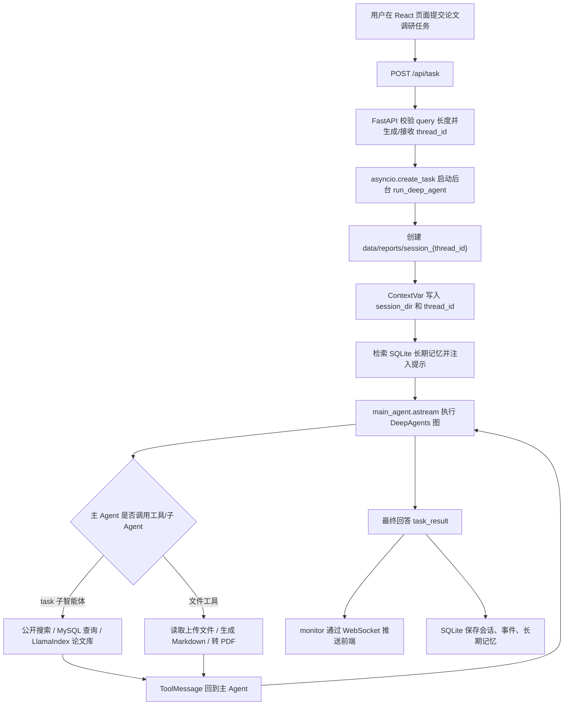

# 项目面试速懂手册

> 适用目标：用 1-2 天把 `deepsearch-agents-main` 这个 AI 辅助开发项目讲清楚，尤其面向 AI Agent / RAG / 大模型应用开发实习面试。本文只按当前代码分析，不把未完整实现的能力包装成已上线能力。

---

## 1. 项目一句话概括

面向科研文献调研场景，基于 DeepAgents、LlamaIndex 与 FastAPI 构建多智能体论文研读系统，实现多源检索、证据沉淀、论文卡片、对比矩阵与 Markdown 综述生成。

---

## 2. 项目整体架构

### 2.1 架构总览

项目是一个前后端分离的论文研究助手，核心不是单纯聊天，而是把“检索资料、沉淀证据、结构化论文、横向对比、生成综述”拆成多个阶段。

| 层级 | 代码位置 | 主要职责 |
|---|---|---|
| 前端交互层 | `frontend/src/App.tsx`、`frontend/src/components/*` | 提交调研任务、上传论文、查看 WebSocket 事件、检索测试、论文卡片、论文矩阵、综述报告下载 |
| API 服务层 | `app/api/server.py` | FastAPI HTTP 接口、WebSocket、后台任务、健康检查、上传下载、检索测试、卡片/矩阵/报告接口 |
| Agent 编排层 | `app/agent/main_agent.py`、`app/agent/subagents/*.py` | DeepAgents 一主三从架构，主 Agent 负责规划和汇总，子 Agent 分别负责网络搜索、数据库查询、论文知识库检索 |
| RAG 检索层 | `app/tools/llamaindex_tools.py`、`app/tools/rerank_tools.py` | LlamaIndex 本地论文库索引，向量检索 + BM25 + RRF，返回结构化 evidence |
| 搜索与数据库工具 | `app/tools/search_tool.py`、`app/tools/db_tools.py` | SearXNG 公网搜索；MySQL 只读查询、表名发现和 SQL 执行 |
| 结构化研究层 | `app/services/paper_card_service.py`、`paper_matrix_service.py`、`review_report_service.py` | EvidenceRecord → PaperCard → PaperMatrix → Markdown 综述报告 |
| 持久化层 | `app/models/session.py`、`app/memory/memory_store.py` | SQLite 保存会话、事件、证据、论文卡片、引用校验、长期记忆 |
| 运行目录层 | `app/config/paths.py` | 用 `DATA_ROOT` 收敛上传文件、报告、论文库、索引、模型缓存、SQLite 文件 |

当前项目使用的是单机 FastAPI + asyncio 后台任务，不是分布式任务队列；长期记忆是 SQLite 关键词检索，不是向量记忆；NL2SQL 是数据库工具 + 只读 SQL 防护，不是完整 Text2SQL 训练系统。

### 2.2 核心流程图



结构化研究产物链路：

```mermaid
flowchart LR
    A["/api/retrieval/test"] --> B["search_paper_evidence_structured"]
    B --> C["EvidenceRecord 保存到 SQLite"]
    C --> D["/api/paper-cards/build"]
    D --> E["PaperCard: problem/method/experiment/conclusion/limitation"]
    E --> F["/api/paper-matrix"]
    F --> G["PaperMatrix 多论文横向对比"]
    G --> H["/api/review-report"]
    H --> I["Markdown 综述报告写入 REPORT_DIR"]
    I --> J["/api/download 下载"]
```



---

## 3. 核心模块拆解

### 3.1 DeepAgents 多智能体编排

#### 3.1.1 抽象原理

这个模块解决的是“复杂调研任务如何拆分与调度”。用户不是只问一个事实，而是可能要求搜索公开资料、查询结构化元数据、读取本地论文、生成综述报告。用普通函数串起来会把检索、生成、文件写入和异常处理混在一起。DeepAgents 把主 Agent 和子 Agent 组织成 Orchestrator-Workers 模式：主 Agent 负责判断下一步做什么，子 Agent 各自负责一个信息源。

不用这个模块也能写，但会变成大量 if-else 和手写 tool_call 循环，扩展新助手时需要改主流程。

#### 3.1.2 代码实现

相关文件：

- `app/agent/main_agent.py`
- `app/agent/subagents/network_search_agent.py`
- `app/agent/subagents/database_query_agent.py`
- `app/agent/subagents/paper_knowledge_agent.py`
- `app/agent/llm.py`
- `app/agent/prompts.py`
- `app/prompt/prompts.yml`

核心实现：

- `create_deep_agent(...)`：在 `main_agent.py` 中创建主 Agent，传入模型、主提示词、文件工具、`InMemorySaver` 和三个子智能体。
- `run_deep_agent(task_query, session_id)`：API 层调用的统一入口，负责创建会话目录、复制上传文件、写入 ContextVar、拼接工作目录指令、检索长期记忆、执行 `main_agent.astream(...)`。
- `network_search_agent`：封装 SearXNG 网络搜索工具 `internet_search`。
- `database_query_agent`：封装 MySQL 工具 `list_sql_tables`、`get_table_data`、`execute_sql_query`。
- `paper_knowledge_agent`：封装 LlamaIndex 论文库工具 `search_paper_library`、`retrieve_paper_evidence`、`build_paper_card` 等。

输入是用户 query 和 thread_id；输出通过两条路径返回：一是 WebSocket 事件，二是最终回答持久化到 SQLite 会话记录。`run_deep_agent` 里会遍历 `main_agent.astream(...)` 的 chunk，发现 `tool_call["name"] == "task"` 时上报子智能体调用，发现最终 content 时上报 `task_result`。

异常处理：

- `asyncio.CancelledError`：上报 `task_cancelled` 后重新抛出。
- 普通异常：通过 `monitor._emit("error", ...)` 推给前端。
- 任务结束后：`reset_session_context(...)` 清理 ContextVar，避免串会话。

#### 3.1.3 面试官会怎么理解

这个模块体现你理解 Agent 编排，不只是“调用大模型 API”。你能讲清楚主 Agent、工具、子 Agent、thread_id、WebSocket 事件之间的关系，说明你有大模型应用工程化意识。

#### 3.1.4 高频追问与回答

**问题 1：为什么用 DeepAgents，而不是自己写 LangGraph？**  
回答：这个项目是一主三从的 Orchestrator-Workers 模式，DeepAgents 正好封装了主 Agent 调度子 Agent 的样板逻辑。自己写 LangGraph 当然可以，但需要手动实现模型节点、工具节点、条件边、子图调度和中断恢复。这里我更关注论文研读业务，所以用 DeepAgents 降低编排成本。后续如果要做更复杂的固定 DAG，比如并行检索后强制合并，我会考虑直接写 LangGraph StateGraph。

**问题 2：主 Agent 如何知道调用哪个子 Agent？**  
回答：子 Agent 在 `subagents/*.py` 中以字典注册，包含 `name`、`description`、`system_prompt` 和 `tools`。DeepAgents 会把这些描述暴露给主模型，主模型根据用户任务和子 Agent 描述决定是否调用 `task` 工具，并传入 `subagent_type`。代码里在 `main_agent.py` 遍历 tool_calls，如果名字是 `task`，就把子智能体调用事件推给前端。

**问题 3：astream 里的 chunk 是什么？为什么要解析 node_name？**  
回答：`main_agent.astream(...)` 会边执行边产出图节点状态，chunk 形如 `{"model": {"messages": [...]}}`。`model` 节点代表主模型决策，里面可能有 tool_calls 或最终回答；工具执行结果会出现在其他节点消息里。项目只重点解析 `model` 节点，因为它能观察主 Agent 是调用子智能体还是返回最终结果。

#### 3.1.5 不能乱说的点

- 不要说自己手写了完整 LangGraph 图，当前主编排主要依赖 DeepAgents。
- 不要说子 Agent 之间直接通信，代码中是主 Agent 统一调度。
- 不要说 checkpointer 是生产级持久化，当前用的是 `InMemorySaver`。
- 不要说训练或微调了模型，代码只是接入 OpenAI 兼容接口。

---

### 3.2 FastAPI 异步任务与 WebSocket 实时反馈

#### 3.2.1 抽象原理

论文调研任务耗时较长，HTTP 请求不能一直阻塞等待 Agent 执行完成。因此项目用 FastAPI 接收任务后立即创建后台协程，前端通过 WebSocket 接收进度事件。这样用户能看到“正在调用哪个助手、哪个工具、最终结果是什么”，而不是页面假死。

不用 WebSocket 也可以轮询，但延迟更高、请求更多，且很难自然表达工具调用流。

#### 3.2.2 代码实现

相关文件：

- `app/api/server.py`
- `app/api/monitor.py`
- `frontend/src/hooks/useDeepAgentSession.ts`
- `frontend/src/lib/api.ts`
- `frontend/src/lib/config.ts`

核心实现：

- `POST /api/task`：校验 query 长度，生成或接收 `thread_id`，取消同 thread_id 旧任务，创建 `asyncio.create_task(_run_agent_with_limits(...))`。
- `_run_agent_with_limits`：用 `asyncio.Semaphore` 控制最大并发，默认 `AGENT_MAX_CONCURRENCY=4`；用 `asyncio.wait_for` 控制超时，默认 300 秒。
- `active_tasks`：内存字典，保存 `thread_id -> asyncio.Task`，用于取消和清理。
- `GET /api/task/{thread_id}/events`：从 SQLite 读取历史运行事件，供断线恢复。
- `websocket_endpoint`：`/ws/{thread_id}` 建立连接，并通过 `ConnectionManager` 注册到对应 thread_id。
- `ToolMonitor._send_to_websocket`：如果当前 loop 和 WebSocket 所在 loop 不一致，就用 `asyncio.run_coroutine_threadsafe` 把发送动作投递回正确事件循环。
- 前端 `useDeepAgentSession`：建立 WebSocket、心跳 ping、断线重连、拉取历史事件、更新进度和文件列表。

异常与容错：

- WebSocket 断开后前端 2 秒重连。
- 后端任务取消用 `task.cancel()`，如果底层同步工具阻塞，会返回 `cancelling`。
- monitor 事件写入 SQLite，断线后可以补拉历史。

#### 3.2.3 面试官会怎么理解

体现后端工程能力、异步编程能力和长任务体验设计。你能讲清楚为什么 HTTP 只负责启动任务，WebSocket 负责推送状态。

#### 3.2.4 高频追问与回答

**问题 1：为什么不用普通 HTTP 直接返回结果？**  
回答：深度调研任务会调用多个工具和子智能体，可能持续几十秒甚至几分钟。HTTP 一直等结果会有超时和用户体验问题。现在的做法是 `/api/task` 只启动后台任务并立即返回 thread_id，后续进度通过 `/ws/{thread_id}` 推送，最终文件通过 `/api/files` 和 `/api/download` 获取。

**问题 2：thread_id 如何保证不会串？**  
回答：thread_id 在前端生成或由后端生成，WebSocket、后台任务、会话目录、SQLite 事件都用同一个 thread_id 关联。后端 `active_tasks` 也按 thread_id 管理任务。同一个 thread_id 新任务会先取消旧任务，避免两个任务同时写同一个会话目录。

**问题 3：为什么 monitor 要处理事件循环？**  
回答：WebSocket 对象通常应该在创建它的 FastAPI 事件循环里发送消息，但工具函数可能在不同调用上下文触发 monitor。`monitor.py` 保存了 server lifespan 中的 loop，发送时如果当前 loop 不一致，就用 `run_coroutine_threadsafe` 把 coroutine 投递回 WebSocket 所在 loop，避免跨 loop 直接操作 WebSocket。

#### 3.2.5 不能乱说的点

- 不要说用了 Celery / Redis 队列，代码里没有。
- 不要说支持多实例任务恢复，`active_tasks` 是进程内内存。
- 不要说 WebSocket 事件一定不丢，断线期间靠 SQLite 历史事件补拉，但活跃任务本身仍在当前进程。

---

### 3.3 LlamaIndex 论文 RAG 与混合检索

#### 3.3.1 抽象原理

RAG 用来解决大模型不了解本地论文内容的问题。项目把 PDF/Markdown/TXT/DOCX 放到论文库目录，通过 LlamaIndex 建索引；查询时先做向量召回，再用 BM25 在候选中计算关键词匹配，最后用 RRF 融合排序。这样兼顾语义相似和关键词精确命中。

不用 RAG，模型只能靠已有知识回答，容易编造论文细节；只用向量检索又容易漏掉缩写、方法名、数据集名等关键词。

#### 3.3.2 代码实现

相关文件：

- `app/tools/llamaindex_tools.py`
- `app/config/retrieval_config.py`
- `app/tools/rerank_tools.py`
- `app/evaluation/evaluate.py`
- `docs/papers/_ground_truth.json`

核心实现：

 - `_manifest()`：文件列表(路径+大小+mtime) + embedding配置 + chunk配置 → SHA256 digest，digest 变了就重建索引。
 - `_configure_embedding()`：支持 openai/local/mock 三种模式。默认为 HuggingFaceEmbedding(all-MiniLM-L6-v2)。embedding 加载失败且 ALLOW_MOCK_EMBEDDING=false 时直接抛异常，拒绝无声降级。
 - `_load_or_build_index()`：digest 一致 → load_index_from_storage；不一致 → SimpleDirectoryReader 读文件 → SentenceSplitter(chunk_size=512, overlap=64) 切分 → VectorStoreIndex 构建 → persist 到 data/paper_index/。
 - `_retrieve_nodes(query, top_k)`：4 层流水线。Layer 1 向量检索取 candidate_k = top_k*2；Layer 2 BM25 在同一批候选上评分；Layer 3 RRF 融合只看排名 1/(k+rank)；Layer 4 封装为 evidence 结构。BM25 降级兜底：如果 max(bm25_scores) < 0.1 则退回纯向量。
 - `_node_to_evidence()`：返回 `{evidence_id, source, page, score, quote, metadata}` 结构化证据。
 
 Agent 使用的四个工具：
 - `search_paper_library`：返回格式化证据文本，走完整 4 层检索
 - `retrieve_paper_evidence`：围绕 claim 检索指定论文
 - `build_paper_card`：返回论文 5 个维度(problem/method/experiment/conclusion/limitation)的证据材料
 - `list_paper_library_files`：列出知识库可用文件
 
 `search_paper_evidence_structured` 是 API 调试接口，不通过 Agent 直接调用。
 
 注意：当前 `search_paper_library` 的主路径是向量 + BM25 + RRF，`rerank_tools.py` 和 `evaluate.py` 有 MiniLM 重排序能力，但在线工具默认没有强制启用。面试时要说"具备可选重排序 / 评测脚本"，不要说"线上每次都重排序"。

#### 3.3.3 面试官会怎么理解

体现你对 RAG 检索链路的理解：索引构建、chunk、embedding、向量检索、BM25、RRF、结构化返回、评测。

#### 3.3.4 高频追问与回答

**问题 1：为什么要混合检索？**  
回答：论文场景里有很多专有名词、方法名和缩写。向量检索能找语义相近的片段，但对精确词可能不稳定；BM25 对关键词精确命中更好，但不懂同义表达。所以我先用向量取候选，再在候选里算 BM25，并用 RRF 融合排序，这样不需要做复杂分数归一化。

**问题 2：RRF 为什么比直接加权平均稳？**  
回答：向量分数和 BM25 分数尺度不同，直接加权平均需要调权重，而且换模型或数据后权重可能失效。RRF 只看排名，公式类似 `1/(k+rank)`，不关心原始分数尺度，所以工程上更稳定。代码里 `paper_matrix` 不涉及 RRF，RRF 在 `llamaindex_tools._retrieve_nodes` 里。

**问题 3：如果本地 embedding 模型加载失败怎么办？**  
回答：`_configure_embedding` 会捕获 local/openai embedding 加载异常。如果 `ALLOW_MOCK_EMBEDDING=false`，会抛出明确错误，避免生产场景悄悄退化；如果只是本地演示，可以显式打开 mock 模式。这个设计的重点是“失败要可见”，不要让检索质量无声下降。

#### 3.3.5 不能乱说的点

- 不要说做了知识图谱，代码里没有图谱构建。
- 不要说线上强制 MiniLM rerank，当前主检索工具不是每次都 rerank。
- 不要说检索指标很大规模，评测集规模有限。
- 不要说 LlamaIndex 使用了外部向量数据库，当前是本地持久化索引。

---

### 3.4 结构化证据、论文卡片、对比矩阵与综述报告

#### 3.4.1 抽象原理

普通 RAG 只返回一段上下文，面试时很难证明生成内容有依据。这个项目新增了分阶段结构化链路：先把检索片段保存成 EvidenceRecord，再把单篇论文整理成 PaperCard，再把多篇论文转成 PaperMatrix，最后生成 Markdown 综述报告。这样每个中间结果都能查看和复用。

不用这层，系统就停留在“检索 + 聊天”，不能很好支撑论文综述、横向对比和引用核验。

#### 3.4.2 代码实现

相关文件：

- `app/models/session.py`
- `app/services/paper_card_service.py`
- `app/services/paper_matrix_service.py`
- `app/services/review_report_service.py`
- `app/api/server.py`
- `frontend/src/components/RetrievalTester.tsx`
- `frontend/src/components/EvidenceArchive.tsx`
- `frontend/src/components/PaperCardPanel.tsx`
- `frontend/src/components/PaperMatrixPanel.tsx`
- `frontend/src/components/ReviewReportPanel.tsx`

核心实现：

- `evidence_records` 表：保存 `thread_id/query/evidence_id/source_type/source/page/score/quote/metadata_json/created_at`。
- `paper_cards` 表：保存 `card_id/title/source/query/fields_json/evidence_json/created_at`。
- `save_evidence_records()` / `list_evidence_records()`：证据持久化与查询。
- `build_paper_card_from_evidence()`：按关键词规则把 evidence 归类到 `problem/method/experiment/conclusion/limitation/summary`。这是确定性规则，不是 LLM 抽取。
- `build_paper_matrix()`：把最近 PaperCard 派生成固定列对比矩阵。
- `write_review_report()`：把矩阵渲染成 Markdown，写到 `REPORT_DIR/session_{thread_id}`，供 `/api/download` 下载。

接口：

- `POST /api/retrieval/test`：检索并保存 evidence。
- `GET /api/evidence`：查看历史 evidence。
- `POST /api/paper-cards/build`：构建并保存 PaperCard。
- `GET /api/paper-cards`：查看 PaperCard。
- `GET /api/paper-matrix`：生成矩阵视图。
- `POST /api/review-report`：生成 Markdown 综述报告。

#### 3.4.3 面试官会怎么理解

体现你不是只会做 RAG 问答，而是能把 RAG 结果产品化成可审计、可比较、可交付的研究工作流。

#### 3.4.4 高频追问与回答

**问题 1：PaperCard 是 LLM 抽取的吗？**  
回答：当前代码里不是 LLM 抽取，而是基于 evidence 片段做规则归类。`paper_card_service.py` 里定义了 problem、method、experiment、conclusion、limitation 的关键词集合。这样做的优点是稳定、可测试、没有额外模型成本；缺点是抽取质量有限，后续可以改成 LLM 结构化抽取并保留规则兜底。

**问题 2：为什么要有 PaperMatrix？**  
回答：综述最重要的不是单篇论文摘要，而是多篇论文之间的横向比较。PaperMatrix 把每张 PaperCard 的方法、实验、结论、局限性整理成同一套列，后续生成综述时就不需要从碎片证据直接生成，而是基于结构化中间结果生成。

**问题 3：综述报告生成是否依赖大模型？**  
回答：当前 `/api/review-report` 是确定性 Markdown 渲染，不依赖 LLM。它读取最近 PaperCard，构造矩阵和章节模板，写入 Markdown 文件。优点是稳定可复现，适合压测和面试演示；缺点是文采和深度不如 LLM 生成，后续可以在此基础上接 LLM 做润色。

#### 3.4.5 不能乱说的点

- 不要说 PaperCard 是高质量 LLM 信息抽取，当前是规则归类。
- 不要说综述报告已经达到论文级写作质量，当前是结构化初稿。
- 不要说 evidence_id 全局唯一，当前 LlamaIndex 结构化 evidence 里是 `kb-1` 这类序号。
- 不要说矩阵有复杂统计分析，当前是从卡片派生的展示视图。

---

### 3.5 MySQL 只读查询工具与 SQL 安全防护

#### 3.5.1 抽象原理

项目中有数据库查询子 Agent，它不是完整的企业级 NL2SQL 工作流，但具备“让模型发现表、预览数据、执行只读 SQL”的工具链。它解决的是论文元数据或教学数据库的结构化查询问题。

不用数据库工具，Agent 只能查非结构化资料，无法回答“有哪些表、某表有哪些字段、执行某个聚合查询”这类问题。

 #### 3.5.2 代码实现
 
 相关文件：
 
 - `app/tools/db_tools.py`
 - `app/agent/subagents/database_query_agent.py`
 - `docker/mysql/mysql.sql`
 - `.env.example`
 
 核心实现：
 
 **安全校验常量**：
 
 ```python
 READ_ONLY_PREFIXES = ("SELECT", "SHOW", "DESCRIBE", "EXPLAIN")
 FORBIDDEN_SQL_WORDS = {"INSERT", "UPDATE", "DELETE", "DROP", "ALTER", "CREATE", "TRUNCATE", "REPLACE", "GRANT", "REVOKE", "CALL", "LOAD", "SET"}
 MAX_RESULT_ROWS = 100
 MAX_EXECUTION_TIME_MS = 5000
 ```
 
 **6 步校验函数 _validate_readonly_sql**：
 
 1. 去掉注释（-- 和 /* */）和首尾空白
 2. 拒绝空 SQL
 3. 检查多语句：如果 ; 出现在末尾括号之外，拒绝
 4. 拆分第一个 token，必须在 READ_ONLY_PREFIXES 中
 5. 逐 token 检查是否在 FORBIDDEN_SQL_WORDS 中
 6. 表名白名单校验（如果配置了）
 
 **三个工具函数**：
 
 - `list_sql_tables()`：执行 `SHOW TABLES` 发现可用表名
 - `get_table_data(table_name)`：先 `SHOW TABLES` 取白名单，校验表名后执行 `SELECT * FROM table LIMIT 100`，反引号转义防注入
 - `execute_sql_query(query)`：先 `_validate_readonly_sql` 校验，再 `SET max_execution_time=5000` 防慢查询，最后执行并捕获异常返回中文错误
 
 注意：这条链路没有 LangGraph 节点式 SQL 生成、EXPLAIN 纠错闭环，也没有 schema RAG；它是 Agent 调用工具的数据库查询能力。面试时可称为"数据库查询子 Agent"或"只读 SQL 工具"，不要讲成完整 NL2SQL 系统。

#### 3.5.3 面试官会怎么理解

体现你有 SQL 安全意识和工具边界意识。即使让 LLM 生成 SQL，也不能直接无保护执行。

#### 3.5.4 高频追问与回答

**问题 1：如何避免 LLM 生成危险 SQL？**  
回答：工具层做了只读校验，而不是只靠 prompt。`execute_sql_query` 会去掉注释，拒绝空 SQL、分号多语句，要求前缀必须是 `SELECT/SHOW/DESCRIBE/EXPLAIN`，并扫描 `INSERT/UPDATE/DELETE/DROP` 等危险关键字。表预览工具还会先查真实表名白名单，再对表名做反引号转义。

**问题 2：这个是不是完整 NL2SQL？**  
回答：严格说不是完整企业级 NL2SQL。它没有独立的 SQL 生成节点、EXPLAIN 自动纠错节点和大规模 schema 检索。当前是数据库子 Agent 通过工具发现表结构、预览数据，再由 LLM 决定是否执行只读 SQL。我会把它表述为“数据库查询子 Agent”或“NL2SQL 雏形”。

**问题 3：如果 SQL 执行失败怎么办？**  
回答：工具会捕获 `mysql.connector.Error` 并返回中文错误字符串，而不是让异常中断整个 Agent。主 Agent 收到错误后可以调整 SQL 或换查询策略。但代码里没有固定的自动纠错循环，所以不能说实现了完整 SQL 自修复。

#### 3.5.5 不能乱说的点

- 不要说实现了完整 NL2SQL 生成-校验-纠错图。
- 不要说有 schema 向量召回，代码中没有。
- 不要说支持写库操作，工具明确只允许只读查询。

---

### 3.6 SearXNG 公开搜索

#### 3.6.1 抽象原理

本地论文库只能覆盖用户上传或已有资料，公开搜索用于补充论文主页、GitHub、博客、新闻和最新研究动态。项目用自托管 SearXNG 替代付费搜索 API，降低成本并便于 Docker 部署。

不用公开搜索，系统只能回答本地知识库里已有的内容，覆盖面较窄。

#### 3.6.2 代码实现

相关文件：

- `app/tools/search_tool.py`
- `app/agent/subagents/network_search_agent.py`
- `docker/docker-compose.yaml`
- `docker/searxng/settings.yml`

核心实现：

- `internet_search(query, topic="general", max_results=5, include_raw_content=False)`：LangChain tool，调用 `SEARXNG_BASE_URL/search`，传 `format=json`。
- topic 映射：`general/news/finance`，其中 finance 暂时映射到 news。
- timeout：`requests.get(..., timeout=5)`。
- 失败处理：连接失败时返回 Docker 启动提示；超时时返回搜索超时提示；其他异常返回错误字符串。

#### 3.6.3 面试官会怎么理解

体现你有多源检索和自托管搜索意识，也知道外部搜索服务会失败，需要兜底。

#### 3.6.4 高频追问与回答

**问题 1：为什么用 SearXNG，不用 Tavily？**  
回答：Tavily 更适合开箱即用，但需要 API Key 和额度。这个项目是面试和本地部署项目，我希望减少外部依赖，所以用 Docker 自托管 SearXNG。它能聚合多个搜索引擎，成本低，也方便演示。当然缺点是搜索质量和稳定性依赖 SearXNG 配置。

**问题 2：SearXNG 挂了怎么办？**  
回答：`internet_search` 捕获连接异常，会返回明确的错误提示和 Docker 启动命令，不会让 Agent 崩溃。Agent 可以继续使用本地论文库或数据库工具。工程上这属于工具级降级。

**问题 3：搜索结果是否会直接作为事实？**  
回答：不应该。搜索结果只是公开资料线索，代码返回标题、链接、摘要和来源引擎。正式报告中仍应结合论文库 evidence 或人工核验。面试时我会强调公网搜索用于补充背景，不等于可信证据闭环。

#### 3.6.5 不能乱说的点

- 不要说有 Google Scholar 官方 API，代码只是通过 SearXNG 聚合搜索。
- 不要说搜索结果做了网页全文抓取和清洗，当前主要依赖 SearXNG 返回摘要。
- 不要说公开搜索结果全部可信，项目没有完整事实核验。

---

### 3.7 SQLite 持久化、会话摘要与引用校验

#### 3.7.1 抽象原理

Agent 系统不能只靠内存，否则页面刷新、WebSocket 断线或任务结束后很多状态都丢失。本项目用 SQLite 存储会话、事件、证据、论文卡片、引用校验和长期记忆。长期记忆用于把历史回答的关键摘要在新任务中作为参考。

不用持久化，会话列表、历史事件、证据归档、卡片、报告核验都无法复用。

#### 3.7.2 代码实现

相关文件：

- `app/models/session.py`
- `app/memory/memory_store.py`
- `app/tools/citation_checker.py`
- `app/api/server.py`

 **6 张 SQLite 表**：
 
 - `sessions`：会话元数据(id, title, query_preview, turns_json, completed)
 - `run_events`：运行事件(thread_id, event_type, data, timestamp)，断线恢复用
 - `evidence_records`：结构化证据(query, source, page, score, quote, metadata_json)
 - `paper_cards`：论文卡片(title, problem, method, experiment, conclusion, limitation)
 - `citation_checks`：引用校验(sentence, evidence_ids, score, verdict, details_json)
 - `memories`：跨会话记忆(key, content, session_id, created_at, updated_at)
 
 WAL 模式：`PRAGMA journal_mode=WAL` + `PRAGMA busy_timeout=30000`，提高并发稳定性。
 
 **跨会话记忆**：
 
 - 任务结束时 `memory_store.save(key, content, session_id)`：去重检查，key 重叠度 >= 0.5 时 UPDATE 否则 INSERT
 - 新任务开始时 `memory_store.search(keyword)`：`WHERE lower(key) LIKE '%keyword%' OR lower(content) LIKE '%keyword%'`，按更新时间 DESC 返回
 - 这不是向量记忆，是 SQLite LIKE 子串匹配
 
 **引用校验（后置 API）**：
 
 - `extract_claims(report_text)`：正则 `【证据: xxx】` 和 `【来源: 标题, p.5】` 提取句子
 - `verify_citations(thread_id, report_id, report_text)`：匹配 evidence_records 表 → MiniLM 计算 claim 与 quote 余弦相似度
 - 三档判定：>=0.5 verified / 0.25-0.5 low_confidence / <0.25 unfounded
 - MiniLM 加载失败时精确 evidence_id 匹配被信任
 - API：`POST /api/report/{thread_id}/verify` 和 `GET /api/report/{thread_id}/verification`
 
 核心函数：`save_session`、`append_turn`、`update_session`、`list_sessions` / `save_run_event`、`list_run_events` / `save_evidence_records`、`list_evidence_records` / `save_paper_card`、`list_paper_cards` / `save_citation_check`、`get_citation_verification` / `memory_store.search(kw)`

#### 3.7.3 面试官会怎么理解

体现你知道 Agent 应用需要状态管理、断线恢复、审计和证据复用，不只是一次性生成。

#### 3.7.4 高频追问与回答

**问题 1：长期记忆是怎么实现的？**  
回答：任务完成后，`run_deep_agent` 会把最终结果前 500 字保存到 `memory_store`，key 取第一个 Markdown 标题或用户 query。下一次任务开始时，用 query 分词后的关键词去 SQLite 里做子串匹配，匹配到的历史摘要注入提示词。它不是向量记忆，所以我不会夸大成语义长期记忆。

**问题 2：引用校验能保证报告完全可信么？**  
回答：不能保证完全可信，它是后置辅助校验。代码能提取报告里的证据标记，匹配 evidence_id 或 source/page，再用 MiniLM 算语义相似度。如果模型加载失败，精确 evidence_id 匹配会被信任。它能发现一部分无依据引用，但不能替代人工审稿。

**问题 3：为什么用 SQLite？**  
回答：项目是单机教学和面试展示场景，SQLite 足够轻量，不需要额外服务；同时比 JSON 文件更适合并发写入。代码里使用 WAL 和 busy_timeout，提高并发写入稳定性。生产多实例部署时，可以迁到 Postgres 或 MySQL。

#### 3.7.5 不能乱说的点

- 不要说长期记忆是向量检索，当前是关键词子串匹配。
- 不要说引用校验已经有大规模准确率评测，代码没有。
- 不要说 SQLite 适合高并发多实例生产，当前只是单机持久化。

## 4. 数据流动全景（按数据类型追踪）

> 当前 Section 6 描述的是代码执行顺序，本节追踪 **数据在每个步骤的形态变化**，帮助串联整个链路。

### 4.1 用户查询 → Agent 执行的数据流

```
用户输入 query = "调研影响最大化算法"
   │
   ▼
Step 1: 前端提交任务
  数据: { query, thread_id }
  去向: POST /api/task → FastAPI
  持久化: SQLite sessions 表插入 {thread_id, query, status=active}

Step 2: 后端启动 Agent 运行环境
  数据: query + thread_id
  操作:
    创建 data/reports/session_{thread_id}/
    从 data/uploads/session_{thread_id}/ 复制用户上传文件
    memory_store.search(query) → 关键词 LIKE 匹配历史摘要 → 注入 prompt
    ContextVar: set_session_context(session_dir)
  事件: monitor → WebSocket → 前端显示 session_created

Step 3: Agent 图执行
  主模型推理 → tool_call:
    { name: "task", args: { subagent_type: "paper_knowledge_agent",
                            query: "影响最大化算法 最新进展" } }
  事件: WebSocket → 前端显示 "正在调用论文知识库助手..."
        ↓
  子 Agent 按职责调用各自工具：
         ↓
    paper_knowledge_agent → search_paper_library(query)
      → _retrieve_nodes(query, top_k=5) → 混合检索（见下方 4.2）
      → 返回结构化 evidence 文本
         ↓
    network_search_agent → internet_search(query)
      → GET http://searxng:8080/search → JSON 结果
      → 返回 [{title, url, snippet}]
         ↓
    database_query_agent
      → list_sql_tables / get_table_data / execute_sql_query
      → 返回 [{paper_id, title, year, abstract}]
         ↓
  所有子 Agent 结果回到主模型 → 综合生成回答
  事件: WebSocket → 实时推送每一步
  持久化: SQLite run_events 表 → 完整事件流

Step 4: Agent 结束
  操作:
    memory_store.save(query, summary) → SQLite memories
    append_turn → SQLite sessions 更新对话轮次
    update_session(status=completed)
    reset_session_context() → ContextVar 清理
  输出: 最终回答 → WebSocket 推送给前端
       工作目录文件 → 前端轮询 /api/files 展示
```

### 4.2 混合检索：数据在每层的具体变换

```
输入: query = "Influence Maximization 算法", top_k=5

Layer 1: 向量检索 (LlamaIndex)
  query → MiniLM embedding → [0.023, -0.145, 0.678, ..., 384维]
  → cosine similarity with index store
  输出: candidate_k=10 条 node，每条含:
    { node_id, text(quote), metadata({file_name, page}),
      similarity_score: 0.82 }

Layer 2: BM25 评分 (同一批候选)
  rank_bm25.BM25Okapi(candidate_texts).get_scores(query)
  输出: 每条候选 node 增加 bm25_score
  特例: if max(bm25_score) < 0.1 → BM25 降级 → 纯向量排序

Layer 3: RRF 融合
  score = 1/(60 + vector_rank) + 1/(60 + bm25_rank)
  sorted by score desc, 取 top_k=5
  输出: 5 条候选，带有融合后 score

Layer 4: 结构化 evidence
  _node_to_evidence() 封装
  输出: [
    { evidence_id: "evt_001",
      source: "Do 等 - 2024 - MIM-Reasoner",
      page: 5, score: 0.87,
      quote: "提出基于理论保证的多重影响最大化推理方法...",
      metadata: {file_path: "Do 等 - 2024 - MIM-Reasoner.pdf"} },
    ... ]
  持久化: SQLite evidence_records 表插入
```

### 4.3 结构化研究产物链：数据层级生长

```
PaperCard (规则分类)
  输入: evidence_records (来自 SQLite)
  操作: paper_card_service.py → FIELD_KEYWORDS 字典匹配
       按 problem/method/experiment/conclusion/limitation 归类
  输出: { title, problem, method, experiment, conclusion, limitation }
  持久化: SQLite paper_cards 表

PaperMatrix (横向拼表)
  输入: 多篇论文的 paper_cards
  操作: paper_matrix_service.py → 横向拼接表格
       每行 = 一篇论文，每列 = 一个字段
  输出: { columns: [论文, 研究问题, 核心方法, ...],
          rows: [ {title, problem, method, ...}, ... ] }

ReviewReport (模板渲染)
  输入: matrix + topic
  操作: review_report_service.py → build_review_markdown
       填充 Markdown 模板：标题 + 元信息 + 表格 + 各字段小节
  输出: .md 文件 → data/reports/session_{id}/ → 前端可下载

CitationVerification (后置校验)
  输入: 生成的 Markdown 报告文本
  操作: citation_checker.py
       正则提取【证据 xxx】标记 → 匹配 evidence_records 表
       → MiniLM 计算 claim vs quote 余弦相似度
  输出: [{sentence, evidence_ids, score, verdict}]
       统计: 覆盖率、verified/low_confidence/unfounded 占比
  持久化: SQLite citation_checks 表
```

### 4.4 前端断线恢复的数据流

```
正常流程:
  前端 WebSocket 连接 /ws/{thread_id}
  后端 monitor 推送事件: session_created, tool_call, task_result
  同时 SQLite run_events 表逐条写入
   ↓ 断线
恢复流程:
  1. 前端检测 WebSocket 断开
  2. 2 秒后自动重连 WebSocket
  3. 同时调 GET /api/task/{thread_id}/events
     → 从 SQLite 读取历史 run_events → 补全界面显示
  4. 继续接收新的实时事件
  5. 如果页面关闭后重新打开:
     → 从 sessionStorage 恢复 thread_id → 同上重连流程
```

### 4.5 数据在持久层的分布

```
data/sessions.sqlite3
├── sessions           ← 会话元数据 (thread_id, query, status, turns)
├── run_events         ← 完整事件流 (WebSocket 断线恢复用)
├── evidence_records   ← 结构化证据 (PaperCard 的原料)
├── paper_cards        ← 论文卡片 (Matrix 的原料)
├── citation_checks    ← 引用校验结果
└── memories           ← 历史会话摘要 (关键词 LIKE 匹配注入)

data/reports/session_{thread_id}/  ← Agent 生成的文件
├── report.md, report.pdf, ...

data/papers/           ← 论文知识库源文件 (PDF, MD, TXT, DOCX)
data/paper_index/      ← LlamaIndex 索引文件 (vector, docstore, index_store)

data/uploads/session_{thread_id}/  ← 用户上传文件
```

> 当前系统数据规模：MySQL 含 11 篇论文元数据、11 位作者、7 个主题、11 条引用关系；本地论文知识库 `data/papers/` 含 3 个 PDF + 8 个 MD 文件；示例知识库 `docs/knowledge_base/` 含 5 个 PDF（电商 2 + 金融 3）。整体为教学演示与面试展示级数据量。

---

## 5. 关键技术原理速懂

### 4.1 Agent

**一句话解释：** Agent 是能根据目标自主决定调用工具、观察结果并继续推理的大模型应用模式。  
**为什么项目需要它：** 论文调研不是一次问答，要搜索、读论文、查数据库、生成文件。  
**代码中怎么体现：** `app/agent/main_agent.py` 用 `create_deep_agent` 创建主 Agent，并注册三个子 Agent。  
**面试口径：** 这个项目的 Agent 不是简单聊天，而是主 Agent 负责规划，子 Agent 负责不同信息源。比如公开搜索、数据库查询、本地论文库检索都被封成工具，主 Agent 根据任务决定调用哪个工具，最后汇总成报告。

### 4.2 DeepAgents / LangGraph

**一句话解释：** DeepAgents 是基于 LangGraph 的多智能体封装，适合一主多从编排。  
**为什么项目需要它：** 降低手写 StateGraph 和子图调度成本。  
**代码中怎么体现：** `main_agent.py` 的 `create_deep_agent(..., subagents=[...], checkpointer=InMemorySaver())`。  
**面试口径：** 我用 DeepAgents 是因为项目刚好是一主三从结构。它帮我处理 tool_call、子智能体调度和图执行样板代码。我的主要工作是定义子 Agent 的职责、工具边界、运行上下文和工程化事件流。

### 4.3 RAG

**一句话解释：** RAG 是先检索外部知识，再把相关片段交给模型生成。  
**为什么项目需要它：** 本地论文内容不在模型参数里，必须检索原文片段。  
**代码中怎么体现：** `llamaindex_tools.py` 构建 LlamaIndex 索引并返回 evidence。  
**面试口径：** RAG 在这个项目里不是只拼接文本，而是返回结构化 evidence，包括来源、页码、分数和原文片段。后续卡片、矩阵和引用校验都依赖这些 evidence。

### 4.4 Hybrid Search

**一句话解释：** 混合检索把向量语义匹配和关键词精确匹配结合起来。  
**为什么项目需要它：** 论文方法名、缩写、数据集名需要关键词命中，开放问题又需要语义匹配。  
**代码中怎么体现：** `_retrieve_nodes` 里先 LlamaIndex 向量召回，再 `BM25Okapi` 算分，最后 RRF 融合。  
**面试口径：** 我没有只用向量检索，因为论文场景专有名词很多。混合检索能同时照顾语义和关键词，RRF 又避免了向量分数和 BM25 分数尺度不一致的问题。

### 4.5 BM25

**一句话解释：** BM25 是基于词频和逆文档频率的关键词相关性算法。  
**为什么项目需要它：** 弥补向量检索对精确词不稳定的问题。  
**代码中怎么体现：** `rank_bm25.BM25Okapi`，tokenizer 可选 split 或 jieba。  
**面试口径：** BM25 更适合找明确出现过的术语，比如论文名、模型名、数据集名。项目只在向量候选集里做 BM25，避免全库 BM25 成本过高。

### 4.6 RRF

**一句话解释：** RRF 用排名倒数融合多个检索器结果。  
**为什么项目需要它：** 不同检索器分数尺度不同，不适合直接加权。  
**代码中怎么体现：** `_retrieve_nodes` 里计算 `1/(k+vector_rank)+1/(k+bm25_rank)`。  
**面试口径：** RRF 的好处是不需要做分数归一化，对不同检索器比较鲁棒。这个项目用它融合向量排名和 BM25 排名，让排序比单一路径更稳。

### 4.7 LlamaIndex

**一句话解释：** LlamaIndex 是文档读取、切分、索引和检索框架。  
**为什么项目需要它：** 快速搭建本地论文知识库。  
**代码中怎么体现：** `SimpleDirectoryReader`、`SentenceSplitter`、`VectorStoreIndex`、`load_index_from_storage`。  
**面试口径：** 我用 LlamaIndex 处理论文库读取和索引持久化，自己在它的 retriever 结果上加 BM25、RRF 和 evidence 结构化，而不是完全依赖默认问答链。

### 4.8 WebSocket

**一句话解释：** WebSocket 是浏览器和后端的长连接，适合实时推送。  
**为什么项目需要它：** Agent 任务时间长，需要展示过程。  
**代码中怎么体现：** `server.py` 的 `/ws/{thread_id}` 和 `monitor.py` 的 `send_to_thread`。  
**面试口径：** HTTP 只负责启动任务，WebSocket 负责推送过程事件。前端根据 thread_id 建连接，后端 monitor 按 thread_id 定向发送工具调用、助手调度和最终结果。

### 4.9 ContextVar

**一句话解释：** ContextVar 是 Python 异步上下文变量，能在同一协程调用链中传递状态。  
**为什么项目需要它：** 深层工具需要知道当前 session_dir 和 thread_id，但不想层层传参。  
**代码中怎么体现：** `app/api/context.py` 的 `_session_dir_ctx`、`_thread_id_ctx`。  
**面试口径：** ContextVar 解决的是并发请求下全局变量串台问题。每个任务启动时设置自己的 session_dir 和 thread_id，工具函数读取当前上下文，任务结束后用 token reset。

### 4.10 SQL 只读防护

**一句话解释：** 在工具层限制 LLM 只能执行只读 SQL。  
**为什么项目需要它：** 防止模型生成删除、修改、建表等危险语句。  
**代码中怎么体现：** `db_tools.py` 的 `_validate_readonly_sql`。  
**面试口径：** 我没有只靠 prompt 约束 SQL，而是在执行工具层做硬校验。包括前缀白名单、多语句拦截和危险关键字过滤。

### 4.11 SQLite + WAL

**一句话解释：** SQLite 是轻量本地数据库，WAL 模式提升读写并发能力。  
**为什么项目需要它：** 保存会话、事件、证据、卡片和引用校验。  
**代码中怎么体现：** `session.py` 和 `memory_store.py` 里 `PRAGMA journal_mode=WAL`。  
**面试口径：** 项目不是生产多实例架构，所以 SQLite 足够；但相比 JSON 文件，它能提供事务和更可靠的并发写入。

### 4.12 引用校验

**一句话解释：** 提取报告中的证据标记，并验证是否能匹配真实 evidence。  
**为什么项目需要它：** 降低报告编造引用的风险。  
**代码中怎么体现：** `app/tools/citation_checker.py` 和 `/api/report/{thread_id}/verify`。  
**面试口径：** 引用校验不是靠模型自觉，而是后置程序检查。它匹配 evidence_id 或来源页码，必要时算语义相似度，给出 verified、low_confidence、unfounded 统计。

---

## 6. 项目主流程代码走读

这里选择最重要的主流程：用户提交论文调研任务，系统实时执行并返回结果。

1. 前端提交任务  
   代码：`frontend/src/App.tsx`、`frontend/src/hooks/useDeepAgentSession.ts`、`frontend/src/lib/api.ts`。  
   用户点击发送后，`submitTask(query)` 调用 `startTask(cleanQuery, threadId)`，POST 到 `/api/task`。前端同时把 `isRunning` 设为 true，等待 WebSocket 事件。

2. FastAPI 接收任务  
   代码：`app/api/server.py` 的 `run_task`。  
   后端校验 `query` 长度不超过 2000。没有 thread_id 就生成 UUID；如果同一个 thread_id 有旧任务，会先 cancel 旧任务。

3. 创建后台任务  
   代码：`asyncio.create_task(_run_agent_with_limits(...))`。  
   `_run_agent_with_limits` 通过 `agent_semaphore` 控制并发，通过 `asyncio.wait_for` 控制超时。这里 HTTP 不等待最终结果，直接返回 `{"status": "started", "thread_id": ...}`。

4. 准备 Agent 运行环境  
   代码：`app/agent/main_agent.py` 的 `run_deep_agent`。  
   创建 `REPORT_DIR/session_{session_id}`，把上传目录 `UPLOAD_DIR/session_{session_id}` 中的文件复制进工作目录。随后通过 `set_session_context` 和 `set_thread_context` 写入 ContextVar。

5. 推送工作目录事件  
   代码：`monitor.report_session_dir(session_dir_str)`。  
   WebSocket 收到 `session_created` 后，前端保存 `sessionPath`，开始轮询 `/api/files` 获取生成文件。

6. 注入工作目录和长期记忆  
   代码：`path_instruction` 和 `memory_store.search(kw)`。  
   path_instruction 明确要求模型只使用相对路径、生成文件必须写入当前工作目录；长期记忆通过关键词匹配历史摘要后注入提示。

   7. 执行 DeepAgents 图  
   代码：`main_agent.astream(...)`。  
   主 Agent 根据用户任务决定调用子 Agent 或文件工具。astream 流式输出的每个 chunk 格式为 `{"node_name": {"messages": [...]}}`，解析逻辑每次只关注主模型决策节点，当 model 节点有 tool_calls 时按 tool_call["name"] == "task" 判断子 Agent 调用，有 content 时视为最终回答。tools 的执行结果会自动回到主模型的下一条消息中，前端不需要单独转发工具输出。

   8. 工具和子 Agent 执行  
   代码：`search_tool.py`、`db_tools.py`、`llamaindex_tools.py`、`markdown_tools.py`、`pdf_tools.py`。  
   每个工具的执行路径：
   - 网络搜索：`internet_search(query)` -> GET `http://searxng:8080/search` 返回 `[{title, url, snippet}]`
   - 数据库查询：`execute_sql_query(sql)` -> `_validate_readonly_sql` 校验通过后执行 -> 返回 `[{paper_id, title, year}]`
   - 论文知识库：`search_paper_library(query)` -> `_retrieve_nodes(query, top_k=5)` 4 层混合检索 -> 返回格式化证据文本
   - 文件生成：`generate_markdown(content, filename)` 写入 `session_dir/filename.md`；`convert_md_to_pdf(md_path)` ReportLab 渲染 PDF
   所有工具异常不抛给 Agent，而是返回明确错误字符串，让主模型自行判断下一步。

9. 最终结果返回  
   代码：`main_agent.py` 中 `monitor.report_task_result(last_msg.content)`。  
   当主模型没有继续调用工具且有 content 时，视为最终回答，通过 WebSocket 推送给前端。

10. 持久化与清理  
    代码：`memory_store.save`、`append_turn`、`update_session`、`reset_session_context`。  
    保存长期记忆、对话 turns、文件数和完成状态。最后 reset ContextVar，避免后续请求复用当前任务上下文。

异常路径：

- 任务取消：`CancelledError` → `report_task_cancelled`。
- 工具失败：多数工具返回错误字符串，让 Agent 自行处理。
- Agent 执行异常：`monitor._emit("error", ...)` 推给前端。
- WebSocket 断线：前端自动重连，并通过 `/api/task/{thread_id}/events` 拉历史事件。

面试口头表达：

> 用户提交任务后，FastAPI 不直接等待 Agent 结束，而是生成 thread_id 并创建后台 asyncio 任务。Agent 执行前会为这个 thread_id 创建独立工作目录，把上传文件复制进去，并用 ContextVar 保存当前 session_dir。随后主 Agent 通过 DeepAgents 的 astream 流式执行，过程中根据任务调用网络搜索、数据库查询或论文库检索子 Agent。monitor 会把工具调用和最终结果通过 WebSocket 推给前端。任务结束后，结果、事件、证据和会话元数据会写入 SQLite，生成的文件放在 `data/reports/session_{thread_id}`，前端可下载。

---

## 7. 项目亮点提炼

### 亮点 1：一主三从多智能体编排

**简历表达：** 基于 DeepAgents 构建一主三从 Agent 架构，主 Agent 负责任务规划和结果汇总，子 Agent 分别处理公开搜索、数据库查询和论文知识库检索。  
**技术解释：** `create_deep_agent` 注册主提示词、文件工具、checkpointer 和三个子 Agent。主模型根据子 Agent 描述决定是否调用 `task`。  
**面试展开：** 我把信息源按职责拆开，避免一个 Agent 同时面对过多工具导致路由混乱。主 Agent 更像研究负责人，子 Agent 是专家工具组。这种设计便于扩展新信息源，比如后续可以加 arXiv API 子 Agent。  
**代码依据：** `app/agent/main_agent.py`、`app/agent/subagents/*.py`。

### 亮点 2：LlamaIndex 混合检索与结构化 evidence

**简历表达：** 基于 LlamaIndex 构建本地论文 RAG，结合向量检索、BM25 和 RRF 融合返回结构化证据，保留来源、页码、分数和原文片段。  
**技术解释：** `_retrieve_nodes` 做向量候选和 BM25 融合，`_node_to_evidence` 转成 evidence。  
**面试展开：** 我没有只把检索结果拼进 prompt，而是把每条结果标准化成 evidence。后续前端展示、论文卡片、引用校验都基于这份结构化证据。  
**代码依据：** `app/tools/llamaindex_tools.py`、`app/models/session.py`。

### 亮点 3：EvidenceRecord → PaperCard → PaperMatrix → ReviewReport

**简历表达：** 将 RAG 检索结果沉淀为结构化 evidence，再逐步组合成论文卡片（规则分类）→ 对比矩阵（横向拼表）→ 可下载 Markdown 综述初稿，形成可追溯的研究报告生产线。  
**技术解释：** `paper_card_service` 归类单篇论文字段，`paper_matrix_service` 派生多论文矩阵，`review_report_service` 渲染 Markdown。  
**面试展开：** 这个项目不停留在 RAG 问答，而是把 RAG 结果逐步加工成结构化研究产物。面试时我可以展示完整链路：检索证据、规则归类生成卡片、横向拼成对比矩阵、导出 Markdown 综述初稿。  
**代码依据：** `app/services/*.py`、`frontend/src/components/PaperCardPanel.tsx`、`PaperMatrixPanel.tsx`、`ReviewReportPanel.tsx`。

### 亮点 4：WebSocket 实时反馈与历史事件恢复

**简历表达：** 基于 FastAPI WebSocket 实现长任务实时进度推送，并将运行事件写入 SQLite 支持断线恢复。  
**技术解释：** `monitor.py` 负责事件发送和持久化，前端 `useDeepAgentSession` 负责心跳、重连和历史事件拉取。  
**面试展开：** Agent 执行不是黑盒，用户可以看到正在调用哪个工具、哪个子 Agent。断线后前端会重连并拉取历史事件，体验比单纯等待 HTTP 返回更好。  
**代码依据：** `app/api/monitor.py`、`app/api/server.py`、`frontend/src/hooks/useDeepAgentSession.ts`。

### 亮点 5：工程安全与稳定性加固

**简历表达：** 对上传、下载、SQL、任务并发和运行目录做工程化加固，包括路径穿越防护、SQL 只读白名单、任务限流超时和健康检查。  
**技术解释：** `_safe_upload_name`、`resolve()+is_relative_to`、`_validate_readonly_sql`、`agent_semaphore`、`/health/live`、`/health/ready`。  
**面试展开：** 我不仅关注 Agent 能不能跑，也关注它会不会乱写文件、乱执行 SQL、任务堆积或状态丢失。这些是从 demo 走向可部署系统必须补的。  
**代码依据：** `app/api/server.py`、`app/tools/db_tools.py`、`app/utils/path_utils.py`、`app/config/paths.py`。

---

## 8. 面试官可能深挖的问题

### 基础理解类

**问题 1：这个项目解决了什么问题？**  
回答：它解决科研文献调研中资料分散、证据难追溯、综述初稿耗时的问题。用户可以输入研究主题或上传论文，系统通过多 Agent 调用公开搜索、数据库查询和本地论文库检索，沉淀 evidence、论文卡片、对比矩阵，最后生成 Markdown 综述报告。

**问题 2：为什么不是普通聊天机器人？**  
回答：普通聊天机器人只给一个回答，很难说明依据来自哪里。本项目把调研过程拆成检索、证据、卡片、矩阵和报告多个阶段，每一步都有结构化数据和接口，面试时可以追溯具体来源。

**问题 3：和普通 RAG 有什么区别？**  
回答：普通 RAG 通常检索后直接生成回答。本项目除了 LlamaIndex 检索，还把结果标准化为 evidence，并进一步生成 PaperCard、PaperMatrix 和 ReviewReport。也就是说它更像论文研读工作流，而不是单次问答。

**问题 4：你在项目中主要做了什么？**  
回答：我的重点是把原本通用深度搜索项目改成论文研读场景，并补上 LlamaIndex 论文库、SearXNG 搜索、SQLite 持久化、证据链、论文卡片、对比矩阵、综述报告、WebSocket 事件恢复和工程安全加固。

### 架构设计类

**问题 5：为什么要用多 Agent？**  
回答：因为信息源职责不同。网络搜索负责公开资料，数据库工具负责结构化数据，论文知识库负责本地论文正文。拆成子 Agent 后，每个 Agent 的提示词和工具更聚焦，主 Agent 只负责规划和汇总，路由更清晰。

**问题 6：如果不用 DeepAgents，怎么做？**  
回答：可以直接手写 LangGraph，定义 model node、tool node、条件边和子图。优点是可控性更强，缺点是开发成本更高。当前项目结构是一主三从，DeepAgents 已经满足，所以我优先用它快速落地。

**问题 7：状态如何在各模块流转？**  
回答：Agent 内部状态主要是 messages，由 DeepAgents/LangGraph 管理；工程状态用 thread_id 串联 WebSocket、任务、会话目录和 SQLite 记录；深层工具通过 ContextVar 读取 session_dir 和 thread_id。

**问题 8：如果一个子 Agent 失败怎么办？**  
回答：大多数工具不会直接抛异常，而是返回错误字符串，比如 SearXNG 连接失败会返回启动提示，数据库错误会返回中文错误。主 Agent 看到错误后可以换策略。底层任务异常则通过 monitor 发 error 事件给前端。

**问题 9：这个系统如何扩展新工具？**  
回答：如果是主 Agent 直接使用的交付工具，就加入 `main_agent.py` 的 tools；如果是新的信息源，比如 arXiv API，就新建一个 subagent 字典，写 name/description/system_prompt/tools，再加到 `subagents` 列表。

### RAG 检索类

**问题 10：chunk size 怎么选？**  
回答：当前代码通过环境变量配置，默认 `LLAMAINDEX_CHUNK_SIZE=512`、overlap=64。512 是一个折中：太短上下文不完整，太长会混入多个主题，降低召回精度。生产中会通过评测集继续调。

**问题 11：如何评估检索效果？**  
回答：代码有 `app/evaluation/evaluate.py`，会读取 `docs/papers/_ground_truth.json`，比较纯向量、混合检索和全链路策略的 Recall@K 与 MRR。不过评测规模有限，我会如实说它是小规模验证，不是大规模 benchmark。

**问题 12：如果检索结果不准，怎么优化？**  
回答：先判断是召回不足还是排序错误。召回不足可以改 chunk、embedding、top_k、BM25 分词；排序错误可以开启 rerank 或调 RRF 参数；如果是资料缺失，则需要补充论文库或公开搜索。

**问题 13：为什么不直接用 RAGFlow？**  
回答：RAGFlow 是完整外部服务，部署成本更高。本项目为了可控和本地演示，把论文库改成 LlamaIndex，本地文件即可建索引。代价是很多高级能力要自己补，比如 evidence、评测和可视化。

### NL2SQL 类

**问题 14：项目里有没有 NL2SQL？**  
回答：有数据库查询子 Agent 和只读 SQL 执行工具，但不是完整企业级 NL2SQL。它能让模型发现表、查看样例、执行只读 SQL；没有独立的 SQL 生成图节点和自动纠错闭环。

**问题 15：如何防止 SQL 注入或误操作？**  
回答：工具层 `_validate_readonly_sql` 会拒绝多语句和危险关键字，只允许只读前缀。`get_table_data` 还会先查真实表名白名单并转义表名。这是硬约束，不依赖 prompt。

**问题 16：EXPLAIN 校验实现了吗？**  
回答：当前允许执行 `EXPLAIN`，但没有固定的“生成 SQL → EXPLAIN 校验 → 自动纠错 → 再执行”的工作流。所以我不会说实现了完整 SQL 自纠错，只会说数据库工具支持只读查询和基础安全防护。

### 工程实现类

**问题 17：FastAPI 接口如何组织？**  
回答：主要集中在 `app/api/server.py`，包括任务、取消、上传、下载、会话、检索测试、证据、论文卡片、矩阵、报告、引用校验、健康检查和 WebSocket。它是单文件接口层，后续可以按 router 拆分。

**问题 18：上传文件如何隔离？**  
回答：上传文件先进入 `UPLOAD_DIR/session_{thread_id}`，Agent 启动时复制到 `REPORT_DIR/session_{thread_id}`。文件名经过 `Path(filename).name` 清洗和后缀白名单校验，防止路径穿越。

**问题 19：Docker 解决什么问题？**  
回答：Docker Compose 用来拉起 MySQL、SearXNG、后端和前端等依赖，降低本地环境差异。但当前是否完整生产可用还要看具体部署验证，我不会说已经上线生产。

**问题 20：前端和后端如何连接？**  
回答：前端通过 `frontend/src/lib/api.ts` 调 HTTP 接口，通过 `frontend/src/lib/config.ts` 计算 API 和 WS 地址；`useDeepAgentSession` 建 WebSocket，收到 monitor_event 后更新界面。

### 安全与稳定性类

**问题 21：如何防 Prompt Injection？**  
回答：没有完整 Prompt Injection 检测系统。当前主要通过工具边界降低风险，比如 SQL 只读、路径限制、文件上传限制、工作目录约束。面试时不能夸大成完整安全治理。

**问题 22：如果外部搜索不可用怎么办？**  
回答：SearXNG 工具会捕获连接异常并返回明确错误，不会让整个 Agent 崩溃。Agent 还能继续使用本地论文库和数据库。前端也能看到工具错误事件。

**问题 23：并发任务如何控制？**  
回答：后端用 `asyncio.Semaphore` 控制 Agent 并发，默认 4；`asyncio.wait_for` 控制任务超时，默认 300 秒。同一个 thread_id 启动新任务会取消旧任务，避免同一会话目录并发写。

**问题 24：SQLite 会不会成为瓶颈？**  
回答：单机面试项目里 SQLite 足够，WAL 模式能改善读写并发。但如果多实例部署或高并发，应该迁移到 Postgres/MySQL，并引入任务队列和集中式状态管理。

### 项目真实性与贡献类

**问题 25：这个项目是你独立完成的吗？**  
回答：项目基于开源 deepsearch-agents 二次开发。我会诚实说明基础框架不是从零写的，但我做了论文场景改造、LlamaIndex 替换、SearXNG 接入、证据链、论文卡片、矩阵、报告生成、SQLite 持久化和工程安全加固。

**问题 26：AI 帮你写了哪些？**  
回答：AI 辅助了部分代码生成和文档整理，但我会逐个模块理解和验证，比如用 compileall、TypeScript 编译和 TestClient 检查接口闭环。面试中我能解释每个关键模块为什么存在、输入输出是什么、失败时怎么处理。

**问题 27：你如何确认代码跑通？**  
回答：我做过静态编译和接口级验证：`python -m compileall -q app tests`、`frontend tsc -b`，并用 FastAPI TestClient 验证 evidence、paper-card、paper-matrix、review-report 等接口闭环。pytest 依赖当前环境未安装，所以不能说完整 pytest 全绿。

**问题 28：如果让你继续重构，优先做什么？**  
回答：第一，把 `server.py` 拆成多个 router；第二，引入 Celery/RQ 或 Arq 做任务队列；第三，把 SQLite 迁移到 Postgres；第四，把 PaperCard 从规则抽取升级为 LLM 结构化抽取 + 规则兜底；第五，扩展 RAG 评测集。

---

## 9. 项目风险点与补救方案

### 风险 1：项目由 AI 辅助开发，面试官担心你不理解

**面试官可能怎么问：** 这些代码都是你写的吗？  
**为什么危险：** 如果答得含糊，会被认为只是复制粘贴。  
**应该怎么回答：** 基础项目来自开源，部分代码和文档由 AI 辅助，但我做了场景迁移、模块改造和验证。我能讲清楚 DeepAgents 编排、ContextVar、WebSocket loop、RAG 检索、SQL 防护和 SQLite 表设计。  
**后续补强：** 准备 3 个手写讲解点：`run_deep_agent`、`_retrieve_nodes`、`_validate_readonly_sql`。

### 风险 2：RAG 评测规模有限

**面试官可能怎么问：** 你的检索效果怎么证明？  
**为什么危险：** 小规模指标说服力不足。  
**应该怎么回答：** 当前有评测脚本和 ground truth，但规模是面试项目级，主要证明混合检索优于纯向量的趋势。生产前需要扩展到更多论文和 100+ 查询。  
**后续补强：** 增加测试集，记录 Recall@K、MRR、citation coverage、no-evidence rate。

### 风险 3：PaperCard 是规则抽取，不是强语义抽取

**面试官可能怎么问：** 论文卡片字段准吗？  
**为什么危险：** 如果说成高质量抽取，会被代码打脸。  
**应该怎么回答：** 当前是确定性规则归类，优点是稳定和可测，缺点是字段质量依赖关键词。后续会接 LLM 结构化输出，并保留 evidence 作为来源。  
**后续补强：** 加 Pydantic schema + LLM JSON mode + 人工校验。

### 风险 4：没有生产级任务队列

**面试官可能怎么问：** 服务重启后任务怎么办？  
**为什么危险：** 当前 `active_tasks` 是内存字典，重启会丢。  
**应该怎么回答：** 当前定位是单机可运行 demo，事件和结果会持久化，但活跃任务不支持跨进程恢复。上线应引入任务队列和任务状态表。  
**后续补强：** Celery/RQ/Arq + Redis + task 状态表 + 重试策略。

### 风险 5：Prompt Injection 防御不完整

**面试官可能怎么问：** 用户上传恶意论文让 Agent 忽略系统提示怎么办？  
**为什么危险：** 大模型应用常见安全问题。  
**应该怎么回答：** 当前没有完整 Prompt Injection 检测，主要靠工具权限边界防止高危操作，比如路径限制和 SQL 只读。内容级注入检测是后续要补的。  
**后续补强：** 文档内容隔离、引用原文时降权、工具调用策略白名单、可疑指令检测。

### 风险 6：没有真实线上用户

**面试官可能怎么问：** 项目上线了吗？有用户吗？  
**为什么危险：** 面试官区分 demo 和生产项目。  
**应该怎么回答：** 目前是个人项目和面试展示项目，没有真实线上用户。我做了部署准备和工程加固，但不会说已生产上线。  
**后续补强：** 云服务器部署、域名/HTTPS、日志监控、用户反馈闭环。

### 风险 7：NL2SQL 能力容易被夸大

**面试官可能怎么问：** SQL 生成失败后怎么自动修正？  
**为什么危险：** 当前没有完整纠错图。  
**应该怎么回答：** 当前是数据库查询子 Agent 和只读 SQL 工具，不是完整 NL2SQL 产品。安全防护做了，但自动纠错闭环还没做。  
**后续补强：** schema RAG、SQL 生成节点、EXPLAIN 校验节点、错误修正节点。

---

## 10. 简历优化建议

### 9.1 推荐最终版（4 条主内容）

技术栈：Python、DeepAgents、LangGraph、LlamaIndex、rank-bm25、FastAPI、WebSocket、SQLite、MySQL、SearXNG、React、Docker

项目背景：面向科研文献调研与综述生成场景，基于开源 DeepSearch Agents 二次开发多智能体论文研读系统，支持论文上传、公开资料搜索、本地论文库检索、结构化证据沉淀、论文对比矩阵和 Markdown 综述报告生成。

• **多智能体任务编排**：基于 DeepAgents + LangGraph 构建“一主三从”Agent 架构，主 Agent 负责任务规划、工具路由和结果汇总，子 Agent 分别封装 SearXNG 公开搜索、MySQL 结构化查询和 LlamaIndex 论文知识库检索，并通过 WebSocket 实时推送工具调用与执行状态。  
• **论文 RAG 与混合检索**：基于 LlamaIndex 构建本地论文索引，使用向量召回获取候选片段，再结合 rank-bm25 关键词评分与 RRF 排序融合，返回包含来源、页码、相似度和原文片段的结构化 evidence，提升论文专有名词和语义问题的召回稳定性。  
• **证据链与综述产物生成**：设计 EvidenceRecord、PaperCard、PaperMatrix、ReviewReport 四阶段链路，将检索片段沉淀为结构化证据、论文卡片、横向对比矩阵和可下载 Markdown 综述初稿，并提供引用校验接口对报告中的证据标记进行后置核验。  
• **异步服务与工程化加固**：基于 FastAPI + asyncio 启动后台 Agent 任务，使用 WebSocket 实时反馈执行过程，SQLite + WAL 持久化会话、事件、证据、卡片和长期记忆；补充任务限流超时、上传文件限制、路径穿越防护、SQL 只读白名单和健康检查接口。

这 4 条的设计逻辑：

| 简历条目 | 面试官最可能问 | 你要主动准备的回答重点 |
|---|---|---|
| 多智能体任务编排 | 为什么要多 Agent？DeepAgents 做了什么？你自己做了什么？ | 讲 `app/agent/main_agent.py`、三个 `subagents`、主 Agent 负责规划，子 Agent 负责信息源；承认 DeepAgents 封装了图执行，自己的工作是职责拆分、工具接入、上下文和事件流。 |
| 论文 RAG 与混合检索 | BM25 和向量检索区别？为什么 RRF？重排序是否在线启用？ | 讲 `llamaindex_tools._retrieve_nodes`；说明向量解决语义，BM25 解决关键词，RRF 避免分数归一化；强调当前主链路是向量+BM25+RRF，MiniLM 重排序主要在评测/可选模块中。 |
| 证据链与综述产物 | PaperCard 是 LLM 抽取吗？综述报告质量如何保证？ | 讲 `services/*.py`；说明 PaperCard 当前是规则归类，ReviewReport 是确定性 Markdown 初稿，优点是可复现，后续可接 LLM 结构化抽取和润色。 |
| 异步服务与工程加固 | WebSocket 为什么需要？ContextVar 会不会串？有没有生产部署？ | 讲 `server.py`、`monitor.py`、`context.py`；说明当前是单机 asyncio，不是 Celery；ContextVar 用 token reset；Docker/健康检查是部署准备，不说已生产上线。 |

### 9.2 稳妥版

技术栈：Python、DeepAgents、LangGraph、LlamaIndex、FastAPI、WebSocket、SQLite、MySQL、SearXNG、React、Docker

项目背景：面向科研文献调研场景，基于开源 DeepSearch Agents 二次开发多智能体论文研读系统，支持主题输入、论文上传、多源检索、证据沉淀、论文卡片、对比矩阵和 Markdown 综述报告生成。

• 多智能体编排：基于 DeepAgents 构建一主三从架构，主 Agent 负责任务规划和结果汇总，子 Agent 分别处理 SearXNG 公开搜索、MySQL 结构化查询和 LlamaIndex 本地论文库检索。  
• 论文 RAG 检索：基于 LlamaIndex 构建本地论文索引，结合向量检索、BM25 和 RRF 融合返回结构化 evidence，保留来源、页码、相似度和原文片段。  
• 结构化研究产物：设计 EvidenceRecord、PaperCard、PaperMatrix 和 ReviewReport 链路，将检索片段沉淀为论文卡片、横向对比矩阵和可下载 Markdown 综述初稿。  
• 工程化实现：基于 FastAPI + WebSocket 实现异步任务和实时事件推送，使用 SQLite 持久化会话、事件、证据、卡片和长期记忆，并补充上传限制、路径防护、SQL 只读校验和健康检查。

### 9.3 强化版

技术栈：Python、DeepAgents、LangGraph、LlamaIndex、rank-bm25、Sentence-Transformers、FastAPI、WebSocket、SQLite、MySQL、SearXNG、React、Docker

项目背景：面向 Agent / RAG 应用开发场景，构建多源论文研读与综述生成系统，覆盖公开资料搜索、本地论文 RAG、结构化证据链、论文对比矩阵、引用校验和报告交付。

• Agent 编排：基于 DeepAgents + LangGraph 封装一主三从 Orchestrator-Workers 流程，主 Agent 通过工具调用动态路由网络搜索、数据库查询和论文知识库子 Agent，并通过 WebSocket 实时暴露执行轨迹。  
• 混合检索：基于 LlamaIndex 构建本地论文索引，使用向量召回获取候选，再通过 rank-bm25 计算关键词相关性并用 RRF 融合排序，解决论文专有名词和语义问题并存的召回场景。  
• 证据链与综述产物：将检索结果标准化为 evidence，并持久化到 SQLite；在此基础上构建 PaperCard、PaperMatrix 和 Markdown ReviewReport，实现从“检索片段”到“综述初稿”的可追溯链路。  
• 稳定性与安全：FastAPI 后台任务采用 asyncio.Semaphore 限流和 wait_for 超时，WebSocket 事件写入 SQLite 支持断线恢复；SQL 工具实现只读白名单、多语句拦截和表名校验，文件接口使用路径解析防穿越。

---

## 11. 复习路线

### 第一天：把主链路讲清楚

上午：

1. 先读 `app/api/server.py`：搞清楚 `/api/task`、`/ws/{thread_id}`、`/api/retrieval/test`、`/api/paper-cards/build`、`/api/review-report`。
2. 再读 `app/agent/main_agent.py`：重点看 `create_deep_agent` 和 `run_deep_agent`。
3. 看三个子 Agent：`app/agent/subagents/*.py`，只需要理解它们的 name、description、tools。

下午：

1. 读 `app/tools/llamaindex_tools.py`：重点 `_load_or_build_index`、`_retrieve_nodes`、`_node_to_evidence`。
2. 读 `app/models/session.py`：知道 SQLite 保存了哪些表。
3. 读 `app/services/paper_card_service.py`、`paper_matrix_service.py`、`review_report_service.py`：理解结构化产物链路。

晚上：

1. 背 1 分钟项目概括。
2. 背 2 分钟主流程。
3. 准备一个 Demo 顺序：上传论文 → 检索测试 → 生成卡片 → 查看矩阵 → 生成 Markdown 报告。

### 第二天：准备深挖和风险问题

上午：

1. 背 RAG 高频问题：混合检索、BM25、RRF、chunk、embedding 失败。
2. 背工程问题：WebSocket 为什么需要、ContextVar 为什么不串、任务如何取消、SQL 如何防护。

下午：

1. 准备真实性回答：开源基础 + 自己二次改造 + AI 辅助 + 自己验证。
2. 准备风险回答：没有生产任务队列、没有真实用户、PaperCard 是规则抽取、NL2SQL 只是雏形。
3. 跑通最小验证：`python -m compileall -q app tests`、`frontend tsc -b`，以及调用 `/api/review-report` 生成一份 Markdown。

面试前最后 30 分钟：

1. 看一遍 `run_deep_agent`。
2. 看一遍 `_retrieve_nodes`。
3. 看一遍 `_validate_readonly_sql`。
4. 看一遍 `review_report_service.write_review_report`。

---

## 12. 输出风格与面试禁忌

### 11.1 面试中建议说的主线

这个项目可以按这条线讲：

> 我基于 DeepAgents 做了一个论文研读多智能体系统。前端提交任务后，FastAPI 启动后台 Agent，并通过 WebSocket 推送过程。主 Agent 会按任务调用公开搜索、数据库查询和 LlamaIndex 论文库检索。检索结果不是直接拼 prompt，而是保存成结构化 evidence，再进一步生成论文卡片、对比矩阵和 Markdown 综述报告。工程上我补了 SQLite 持久化、上传和下载安全、SQL 只读防护、任务限流超时和健康检查。

### 11.2 不能乱说的点

| 不要这样说 | 原因 | 稳妥说法 |
|---|---|---|
| 我训练了大模型 | 没有训练脚本 | 接入 OpenAI 兼容 LLM，通过 RAG 和 Agent 编排提升能力 |
| 我实现了完整 NL2SQL | 没有 SQL 生成-校验-纠错图 | 实现了数据库查询子 Agent 和只读 SQL 防护 |
| 我做了知识图谱 | 没有图谱结构 | 做了 SQLite 结构化证据、论文卡片和矩阵 |
| PaperCard 是高级语义抽取 | 当前是规则归类 | 当前用规则归类，后续可接 LLM 结构化抽取 |
| 已经生产上线 | 没有真实生产部署证据 | 完成本地/Docker 化运行准备，尚未生产上线 |
| 支持分布式任务恢复 | active_tasks 是内存 | 当前是单机异步任务，后续可接任务队列 |
| 长期记忆是向量记忆 | 当前是关键词子串匹配 | SQLite 保存长期记忆，用关键词检索注入上下文 |

### 11.3 最适合展示的代码位置

- `app/api/server.py`：任务启动、WebSocket、检索/卡片/矩阵/报告接口。
- `app/agent/main_agent.py`：主 Agent 执行入口和 ContextVar。
- `app/tools/llamaindex_tools.py`：论文 RAG 检索。
- `app/models/session.py`：SQLite 表和持久化函数。
- `app/services/review_report_service.py`：从矩阵到 Markdown 报告。
- `frontend/src/hooks/useDeepAgentSession.ts`：前端 WebSocket、重连和事件处理。

---

## 附：当前代码真实性检查结论

- 代码中发现完整实现：FastAPI 接口、WebSocket 推送、DeepAgents 主从编排、SearXNG 工具、MySQL 只读工具、LlamaIndex 本地论文检索、SQLite 会话/事件/证据/卡片/引用持久化、论文卡片、对比矩阵、Markdown 报告生成。
- 代码中仅有雏形：NL2SQL、长期记忆、引用校验评测、Prompt Injection 防御。
- 代码中未发现完整实现：模型训练/微调、分布式任务队列、多租户权限系统、线上监控告警、知识图谱、真实生产部署闭环。
